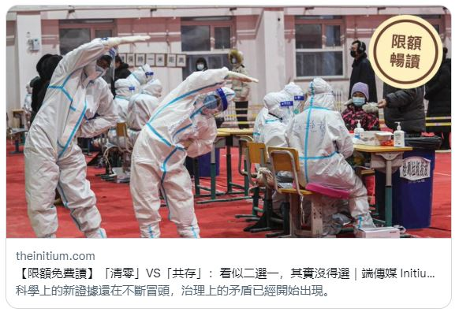

My article on the "framing" of Covid is just out on Initium Media (in Chinese)

[link](https://theinitium.com/article/20201224-opinion-covid19-exist-or-zero-is-not-a-choice/invite_token/iULbhsFkjw)

For East Asian societies - the "winners" in 2020 covid responses, the challenge now is to accept the fact that because of the new variants, we might not be able to eradicate Covid at all by vaccination. The current decision-making of whether to "wipe-out" the virus or to "co-exist" with it is not only about the evaluation of scientific "evidence", but how a society interpret and frame the data and its significance and governance. 

More importantly, the transitions between "frames" are deeply social and cultural - and sometimes take a long long time. 

